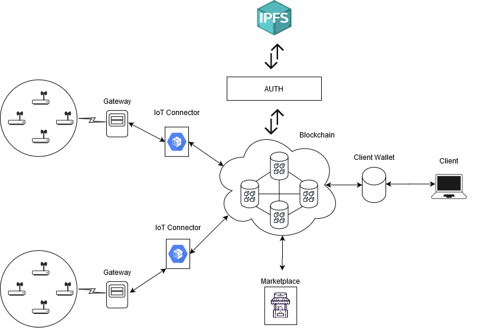
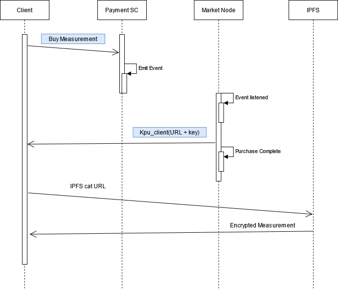

<h1>Blockchain Marketplace</h1>
This is a Blockchain based platform that enables the purchase of IoT measurements directly from the IoT suppliers in an easy and transparent way. IoT provider can use this platform to publish their measurements, so clients can purchase them. The inherent properties of Blockchain technology allows the recording of every action produced within the platform. Thus, ensuring transparency.

This platform aims to achieve the following key points:
<li>Guarantee that customers purchase measurements.</li>
<li>Guarantee the delivery of the measurements to those clients who purchased them.</li>
<li>Guarantee the reliabilty of the measurements provided by the IoT suppliers.</li>

<h1>Architecure</h1>
In this <a href="#gen-arch">figure</a> you can see the general architecture of the system. The core of the platform is the Blockchain. This element is an Ethereum Blockchan that uses Clique as consensus model. Inside the Blockchain there are four smart contracts running on it.

<ul><a href="./storage/contracts/dataContract/data.sol">Data SC</a>: Stores the encrypted URL where the measurement is located in the Blockchain, so it is available to be purchased. In addition to the URL,  this contract also stores the symmetric key, encrypted with the public key of the administrator of the platform,  to decipher the value of the measurement </ul>
<ul><a href="./storage/contracts/accessContract/accessContract.sol">Access Control SC</a>: Controls the users who can introduce measurements in the Blockchain. Only those IoT suppliers approved by the administrator of the platform can insert new content in the platform. Moreover, this SC stores the public keys of the customers that participates in the platform.</ul>
<ul><a href="./storage/contracts/balanceContract/balance.sol">Payment SC</a>: Manages the purchases of the clients. It guarantees that a measurement has been bought by a client</ul>
<ul><a href="./storage/contracts/balanceContract/ERC20.sol">ERC20 SC</a>: Defines the Token that will be used in the platform and enables its exchange between customers and IoT suppliers.</ul>

These are ruled by the administrator of the platform. This user is responsible for adding or/and removing new IoT producers to the platform, delivering the measurements purchased by customers and configuring the parameters of the smart contract (i.e. total amount of tokens).

Besides the Blockchain, several elements participate within the platform. One of these components is the IoT connector. This is a proxy between the IoT gateway and the platform. It encrypts the measurements with a random symmetric key and stores them in the IPFS network, then it stores all the information needed to retrieve the measurements in the Blockchain. Specifically, it stores the IPFS URL and the symmetric key encrypted with the public key of the administrator of the platform., it stores the IPFS URL and the symmetric key encrypted with the public key of the administrator of the platform.

To store the value of the measurements, the platform uses a private IPFS network. Each of the IoT suppliers and the marketplace has an IPFS node that they can use to store the value of the measurements. This node is protected with an authentication module that controls who inserts information in the network. To do so, it uses the Blockchain, in particular the Access SC, to check whether the IoT provider has access to the IPFS network or not. Besides the IoT IPFS nodes, the marketplace has its own IPFS node to retrieve the value of the measurements.

The marketplace is in charge of listening to the purchase events produced in the Blockchain whenever a client buys a measurement. Once this component listens to an event, it retrieves the complete value of the acquired measurement from the IPFS storage and deciphers the symmetric key stored in the Data SC with its private key. Then, it encrypts the symmetric key with the public key of the client who made the purchase and sends the encrypted measurement plus the encrypted symmetric key to the client. The customer only has to decipher the symmetric key with its private key and use it to decrypt the value of the measurement. 

Customers can use a webserver (Clients Wallet) to browse and purchase the different measurements available in the platform. Through this component, clients can purchase measurements and see their value easily. 

  
  
General architecture of the platform

<h2 id="marketplace">Marketplace overview</h2>
The marketplace is responsible of ruling the smart contracts running in the Blockchain. It is in charge of processing the purchasing requests of customers. It has to guarantee that the exchange of information between IoT providers and customers has been carried out successfully.

This component uses its own IPFS node to retrieve the value of the measurements from the IPFS network.

Funcionalities:
<li>Register IoT suppliers in the platform so they can sell measurements. To do this, it assigns Ethereum accounts to IoT suppliers and register them in the access control smart contract.</li>
<li>Listens the purchasing request events produced within the Blockchain and process them. This component is always listening the interactions within the Blockchain.</li>
<li>Acts as an access point for the administrator of the platform. From this component, he can change remove measurements from the platform or revoke transactions.</li>

The following figure shows how the marketplace processes customers' purchases.

  
  
Processing of purchases

In the previous figure, the delivery of the purchased measurements to clients are carried out through the Blockchain. This is doing by sending the IPFS URL and the symmetric encryption key within a Blockchain transaction. Both fields are encrypted with the public key of the customer who made the purchases. Thus, assuring that only that customer can obtain the value of the measurement. Furthermore, we also guarantee the delivery of the measurement to the appropriate customer because the transaction is registered in the Blockchain.

<h1>Smart Contracts</h1>
In this section, I am going to describe the functionalities of the SCs running in the platform.

<h2>Data SC</h2>
This smart contract is in charge of storing the minimal information needed to retrieve the measurements. It is composed by the following variables and functions:

- `dataStruct` (variable): Structure that stores the information of the measurements stored in the platform.
- `ledger` (variable): Mapping that associates measurement hashes to measurements (`dataStruct`). It receives a hash and returns a `dataStruct`. 
- `storeInfo` (function): Stores the IPFS CID, the description of the measurement and the Ethereum address of the IoT provider who spawned the measurement in the Blockchain. To do so, this SC uses a mapping variable, which associates the Ethereum address of the IoT supplier with the struct `dataStruct`. This struct is used to store the aforementioned information. 
- `deleteMeasurements` (function): Removes a measurement from the marketplace. Only the administrator of the marketplace can use this function. 
- `setAddress` (function): Set the address of the Access Control SC in this contract so we can use some of its functions. It is basically a way of communicating between SCs. This function must be called after deploying the Data SC in the Blockchain. 
- `checkAccess` (function): Checks the whether an IoT supplier has access to the marketplace. To do so, it checks the value of the public variable `allowedAccounts` of the Control Access SC.
- `getIoTAddress` (function): Gets the address of the IoT supplier who spawned the measurement in the marketplace from hash of the measurement.  It uses the public variable `ledger`.

<h2>Access Control SC </h2>
This smart contract is responsible for controlling the access to the platform. It authorizes IoT provider and stores public keys of customers and IoT providers in the BC. It is composed by the following variables and functions:

- `allowedAccounts` (variable): Mapping that associates Ethereum address of IoT suppliers to Booleans. It will be true if an IoT supplier has access, false otherwise.
- `PubKeysKeystore` (variable): Mapping that associates Ethereum address to the public keys of the users (IoT suppliers and customers) to public keys.
- `ProducersNameMap` (variable): Mapping that associates Ethereum addresses to names. It is used to name the Ethereum address of the IoT suppliers. For example: 0x21A018606490C031A8c02Bb6b992D8AE44ADD37f to SmartSantander. 
- `addAccountToRegister`  (function): Authorizes Ethereum address to store information in the Blockchain. This function can only be called by the administrator of the platform. 
- `removeAccountFromRegister` (function): Removes Ethereum addresses from the `allowedAccounts` variable. This function can only be called by the administrator of the platform.
- `addPubKey` (function): Stores the public key of customers and IoT suppliers in the variable ` PubKeysKeystore`
- `returnAllowedAddresses` (function): Returns an array with all the authorized IoT suppliers.
  

<h2>Payment SC</h2>
This smart contract is in charge of managing the payments of customers. It registers every exchange of measurements in the Blockchain. It is composed by the following variables and functions:

-  `retainedMoneyStruct ` (variable): Structure used to block money until the payment is approved by the administrator. When a customer buys a measurement, the money used in the transaction is blocked until the he receives the measurement. This, prevents the purchase of different measurement with the same money. Therefore, this struct stores the Ethereum address of the seller and the number of tokens paid by the customer.
- `prices` (variable): Mapping that associates measurements hashes to their price. It can be used by customer to check the price of a measurement.
- `retentions` (variable): This is a mapping variable that maps measurement hashes (byte32) to another mapping, which associates Ethereum addresses to the struct `retainedMoneyStruct `.  The purpose of this variable is to control the retained money in the payment process.
- `setPriceToMeasurement` (function): Sets the price of a measurement. IoT suppliers can only set the price of their own measurements.
- ` getPriceMeasurement` (function): Gets the cost of a measurement. It basically returns the value of the variable `prices`.
- ` purchaseMeasurement ` (function): Initializes the purchase of a measurement. This process consists on transfer the tokens from customers to a dummy account, which retains the money until the measurement is delivered. This dummy account is controlled by the administrator of the platform and this is its sole purpose. Additionally, until the measurement is delivered, the purchases is registered in the ` retentions ` variable.
- ` completePurchase ` (function): Once a measure is delivered to the buyer, the administrator of the platform calls this function. This function checks the amount of tokens retained in the ` retentions` variable and transfers this amount from the dummy account, which was used to stored the retained tokens, to the buyer. 
- ` revokeTransaction` (function): Revokes a purchase. This function can only be called by the administrator of the platform whenever a measurement cannot be delivered to the buyer. In consequence, it clears the retention entry stored in the ` retentions` variable and transfers the retained money from the dummy account to its rightful owner.
- ` sendTokenToClient` (function): Function used by the administrator of the platform to send tokens to Ethereum addresses. By using this function, the administrator can send tokens to those users who have none.
- ` setAddress` (function): Set the address of the Data SC, so it can use some of its functions/variables. This function must be called by the administrator of the marketplace after deploying the Payment contract. 

<h2>ERC20 SC</h2>
The purpose of this contract is to set an economy within the marketplace. It is based on ERC20 SC but with some small modifications. It is composed by the following variables and functions:

- `balances` (variable): Maps Ethereum addresses to the amount of tokens that they have.
- ` allowed` (variable): It allows the delegation the transfer of tokens. For example, an Ethereum account delegate its payment to another account.
- ` totalSupply_ ` (variable): It shows the total supply of tokens.
- ` setTotalSupply `(function): This function can only be used by the administrator of the platform and sets the total supply of tokens.
- ` totalSupply ` (function): Returns the total supply.
- ` balanceOf ` (function): returns the balance of an Ethereum address.
- ` transfer ` (function): Allows the transfer of tokens amongst accounts.
- ` approve ` (function): This function approves delegated transfers.
- ` transferFrom ` (function): It allows the transfer of tokens from the dummy account to the users (IoT suppliers and customers). This function can only be used by the administrator of the platform.

<h1>Components involved</h1>
<li><strong><a href="#marketplace">Marketplace</a></strong></li>
<li><strong><a href="https://github.com/igonzaleztak/IoT-proxy">IoT Connector</a></strong></li>
<li><strong><a href="https://github.com/igonzaleztak/nodejs-wallet">Client Wallet</a></strong></li>